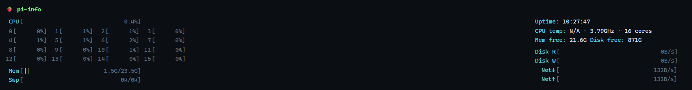

# pi-info

ラズベリーパイのシステム情報（CPU・メモリ・ディスクIO・ネットワーク速度）を取得し、
等幅フォントの端末風 Web ダッシュボードで表示するモニタリングアプリ。



- **バックエンド**: Python + FastAPI + psutil
- **フロントエンド**: 素の HTML/JS（1.5秒ごとに自動更新、外部依存なし）
- **配布**: Docker で内包（arm64/armv7 対応）

## 取得・表示する情報

| カテゴリ | 内容 |
|----------|------|
| CPU | 全体使用率＋コア別使用率（1行4コアのブラケットメーター）、温度、周波数、コア数 |
| メモリ | 使用量／全体（`used/total`）、空き（available）、Swap |
| ディスク | Read／Write スループット、空き容量 |
| ネットワーク | 受信（↓）／送信（↑）スループット |
| その他 | Uptime |

- CPU コアは `0[||||  45%]` のようなブラケットメーターで、1行4コアずつ表示します。
- ディスクIO・ネットワークは累積カウンタの差分から速度を算出するため、バックエンドが
  1秒間隔でサンプリングしています。
- メモリのバーはラベルの `used/total` と一致します（キャッシュを空き扱いする `percent`
  ではなく実使用量ベース）。

## 使い方（Docker / 推奨）

ラズパイ上で:

```bash
docker compose up -d --build
```

停止:

```bash
docker compose down
```

### 待ち受け（HOST / PORT）

環境変数 `HOST` / `PORT` で待ち受け先を変更できます（`docker-compose.yml` の
既定は `127.0.0.1:8001`）。

- 既定は localhost のみ。LAN から直接開きたい場合は `HOST=0.0.0.0` に変更 →
  `http://<ラズパイのIP>:8001`
- `network_mode: host` のため `ports:` 指定は使いません。ポートは `PORT` で変更します。
- フロントの API 取得は表示中ページからの相対パスなので、サブパス配下
  （`/pi/` 等）にマウントしても動作します。

### Docker 構成のポイント

- `network_mode: host` … ホストの実ネットワークカウンタ（eth0/wlan0 等）をそのまま取得するため。
- `/sys/class/thermal` を読み取り専用マウント … ラズパイの CPU 温度を取得するため。

`python:3.12-slim` ベースで、psutil は arm64/armv7 向けのビルド済み wheel が
提供されるため、ラズパイ上でもそのままビルドできます。

## 使い方（ローカル / Docker なし）

```bash
cd backend
python -m venv .venv && source .venv/bin/activate
pip install -r requirements.txt
uvicorn app:app --host 0.0.0.0 --port 8001
```

## API

| エンドポイント | 説明 |
|----------------|------|
| `GET /` | ダッシュボード HTML |
| `GET /api/metrics` | 現在のメトリクス（JSON） |

### `/api/metrics` レスポンス例

```json
{
  "timestamp": 1783843567.5,
  "cpu": { "percent": 0.8, "per_cpu": [0.7, 0.0, 0.4, 0.4], "count": 4,
           "freq_mhz": 1800, "temp_c": 48.3, "load_avg": [0.1, 0.2, 0.1] },
  "memory": { "total": 4127946752, "used": 812345344, "available": 3100000000,
              "percent": 24.9, "swap_total": 0, "swap_used": 0, "swap_percent": 0.0 },
  "disk": { "total": 62537072640, "used": 9046491136, "free": 50000000000,
            "percent": 15.3, "read_bps": 0.0, "write_bps": 0.0 },
  "network": { "sent_bps": 1024.0, "recv_bps": 8192.0 },
  "uptime_sec": 25227.5
}
```

`network` は有線インターフェース **`eth0`** のみを集計します（環境変数
`NET_IFACE` で変更可、例: Wi-Fi なら `NET_IFACE=wlan0`）。ループバックや
仮想インターフェースを混ぜると、送信＝受信で対称になり上り下りが同値に
見えるため、対象を単一インターフェースに絞っています。

## 構成

```
pi-info/
├── backend/
│   ├── app.py           # FastAPI エントリポイント（HTML配信 + API）
│   ├── metrics.py       # メトリクス収集 + バックグラウンドサンプリング
│   └── requirements.txt
├── frontend/
│   └── index.html       # ダッシュボード（単一ファイル）
├── docs/
│   └── screenshot.svg   # README 用 UI プレビュー
├── Dockerfile
├── docker-compose.yml
├── .dockerignore
├── .gitignore
└── README.md
```

## 補足

- CPU 温度が `N/A` の場合、その環境にセンサーが無い（PC 等）か、
  `/sys/class/thermal` がマウントされていません。ラズパイ実機なら取得できます。
- 高頻度でポーリングされる `/api/metrics` のアクセスログは、ログが膨大に
  ならないようバックエンド側で抑制しています（起動ログやその他のアクセスは残ります）。
- `load_avg` は API では返していますが、ダッシュボードには表示していません。
